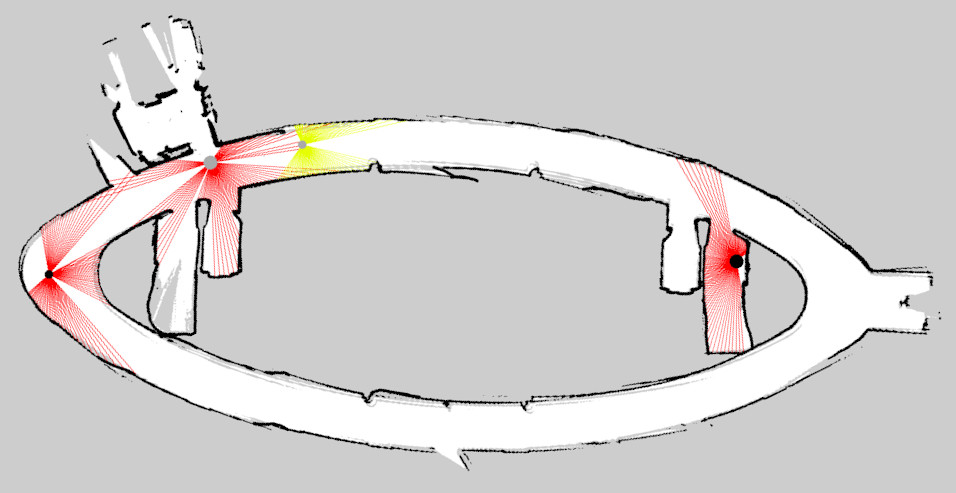

# map_simulator

This package provides a 2D simulator for mobile robots in ROS 2. The environment is based on a standard ROS map. Robots move through a `cmd_vel` topic and may publish a laser scan.

The motivation is to have a light weight simulator to demonstrate and test navigation capabilities, while using a simple map-based environment. The simulation is based on OpenCV.

## Dependencies

- OpenCV
- [simple_launch](https://github.com/oKermorgant/simple_launch), installable through `apt install ros-${ROS_DISTRO}-simple-launch`

# Running the simulation

Just launch `simulation2d_launch.py` by passing the `map` argument that should point to the yaml file of the map.

Setting `map_server:=true` also runs the corresponding map server.

Setting `display:=false` runs the simulation without display.

The Simulation node advertises a service to spawn robots in. This service is wrapped into the `spawn` executable.

## Spawning a robot

The `spawn` node should be run in the same namespace as the `robot_description` topic. This namespace is used to publish topics.

This node takes the following arguments, which reflect the request part of a `Spawn` service:

- `x`, `y`, `theta`: where to spawn the robot
- `shape`: `circle`, `square` or `rectangle`
- `radius`: the radius of the robot, if circle or square (e.g. side length)
- `size`: 3 values as (width, length, x-offset) in case of a rectangle shape (used for display + laser detection from other robots)
- `robot_color`: a length-3 RGB (0-255) int array
- `laser_color`: a length-3 RGB (0-255) int array
- `force_scanner`: a Boolean (default True) to publish laser scans even if the URDF does not contain any laser scanner
- `static_tf_odom`: a Boolean (default False) to run a static TF broadcaster of the map -> odom frame of this robot
- `zero_joints`:a Boolean (default False) to publish 0-values for all non-fixed joints of the robot
- `linear_noise` and `angular_noise`: a float (default 0) for the standard deviation of the noise added to the robot velocity twist,

If a Gazebo laser plugin is found, the laser scans will be published with the same specifications.

If a robot is spawned twice, only the pose will be reset. If any other parameter should be changed, remove it and re-spawn it with the new configuration.

## Unspawning robots

Just double-clic on the robot you want to remove. It cannot be done if `display` was set to False.

## Robot topics

The `cmd_vel` topic is subscribed by the simulator, for each robot according to their namespaces.

By default, the `scan` topic is used to publish laser scans, unless another topic is explicitely found in the URDF as a Gazebo plugin.

## Spawning an obstacle

The `spawn` node will spawn anything at the requested pose / size. If no `robot_description` topic is found, `cmd_vel` and `scan` topics will not be initialized but the spawned entity will be detected in the laser scans of other robots.

## Spawning range beacons

If the package `anchor_msgs` is available at compile-time then the simulator can render range measurements between the robots and some beacons put at any (x,y) position. The `spawn_anchor_launch.py` offers a simple way to spawn such anchors.
- the real anchor positions are given as the `<name>_gt` frame under `/tf`,
- any localization algorithm should use the `<name>` frame, that is at the same place as `<name>_gt` if `publish_gt` is true in `spawn_anchor_launch.py`. Otherwise, some range-only SLAM node should be used to estimate the positions of the anchors from some custom initialization.

As soon as some anchors are spawned, a `range` topic will be published in each robot's namespace.

## Using steering wheels robots

A helper node `kinematics.py` is available to link the command and the current joint state, especially for bicycle / Ackermann and two-steering robots. This node should be run in the robot namespace and will parse the `robot_description` in order to identify the robot type (unicycle / bicycle / Ackermann / two-steering) from the topology of the joints.

 - for unicycle robots, this node will subscribe to `cmd_vel` and publish the corresponding angle of the wheels
 - for other robots, it subscribes to `cmd` of type `std_msgs/Float32MultiArray`. This topic is assumed to be the one used for low-level control:
    - `(front wheel velocity, steering velocity)` for bicycle robots
    - `(front wheel velocity, front steering velocity, rear steering velocity)` for two-steering robots
 - Ackermann-like robots will be added a dummy joint called `steering` that represents the actual steering angle

The node will publish the corresponding `joint_states` and, if the parameter `pub_cmd` is `True` it will also publish the corresponding Twist.

It will also set the `(b, r)` (unicycle) or `(L, ~)` (other) parameters that are the wheel distance and radius parsed from `robot_description`.

Set the parameter `rotate_wheels` to `False` in order not to display the rotation of the wheels (may lag a bit in RViz).

This allows testing high-lever controllers for steering wheels robots.

## Examples

See the `example` folder to see how to:
- spawn R2D2 with default laser props
- spawn Turtlebot3 with Gazebo-specified laser props
- run RViz to display robots, laserscans and the map
